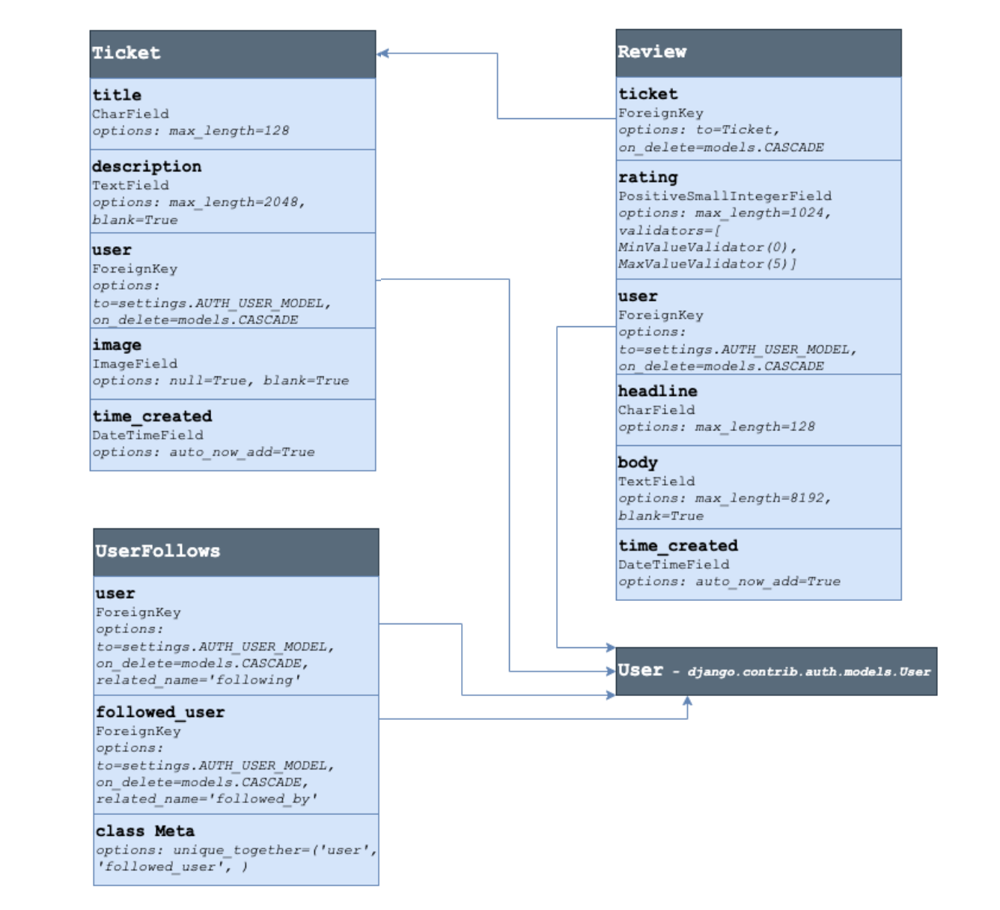
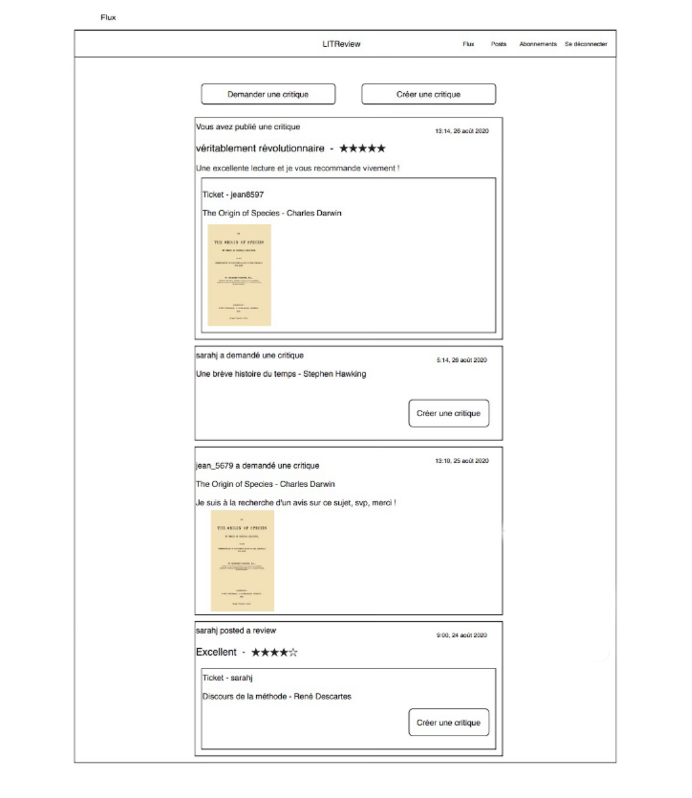
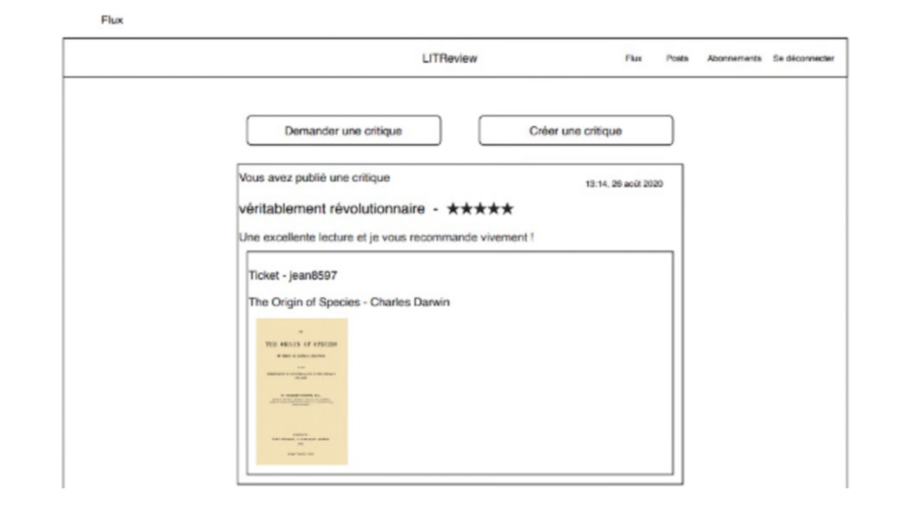
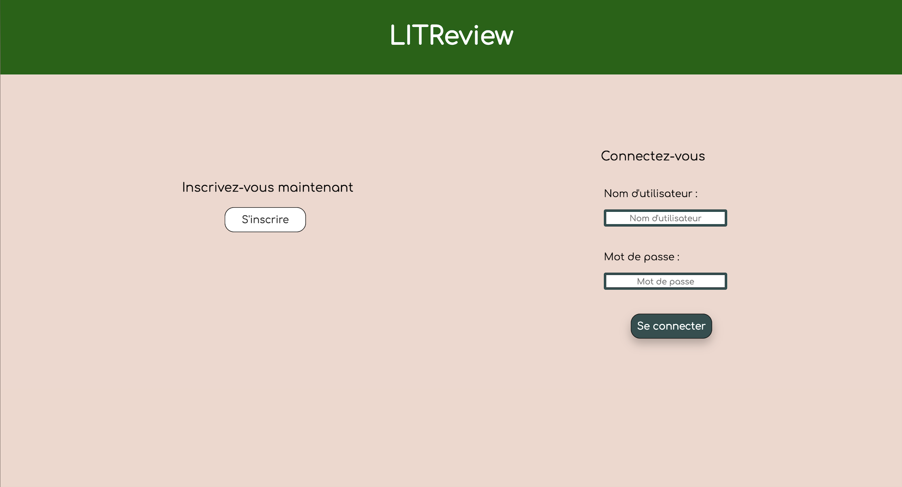
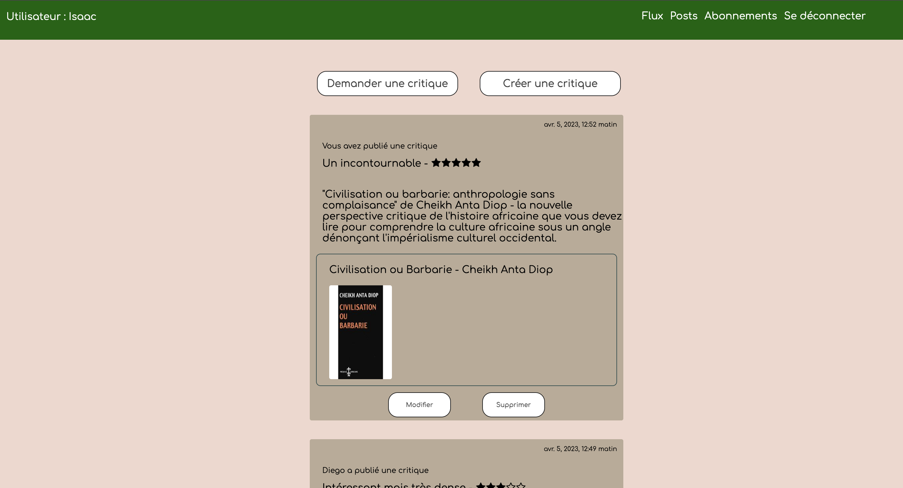
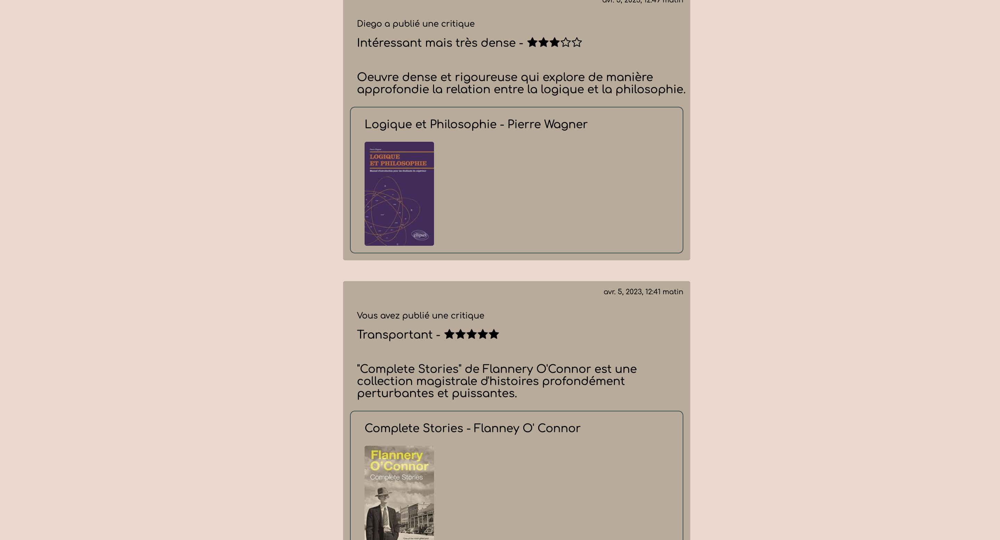
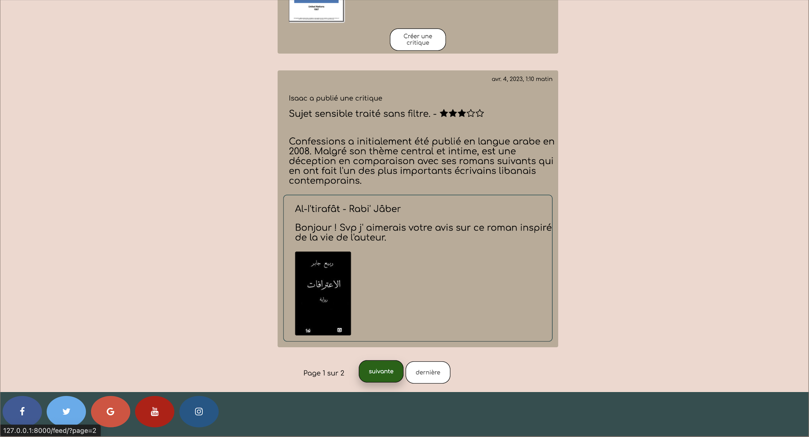

## Project : Develop a web application using Django

[**Français**](README-fr.md)
<p align="center">
  
  
  
</p>
<p align="center">
  
  
  
  
</p>

### Table of contents :
1. Project description/Scenario.
2. Compatible configurations.
3. Installing the program.
4. Features.
5. Running the program.

## 1. Project description/Scenario :

This project was carried out as part of the Python Developer training offered by OpenClassrooms.

The startup LITReview aims to market a product that allows a community of users to consult or 
request a book review on demand. Consequently, LITReview is looking to create a web application 
for its MVP (minimum viable product).

The back-end of this web application has been developed with the Django framework, 
and the front-end with HTML and CSS.

## 2. Configurations compatibles :

* Python 3
* Windows 10
* Mac
* Linux

## 3. Installing the program :
This program uses the following Python libraries :

```
asgiref 3.6.0
Django 4.1.7
Pillow 9.4.0
sqlparse 0.4.3
```

## 4. Features :

### *Authentication* : 
  * Inscription
  * Connection
### *Menu* : 
  * Feed
  * Posts 
  * Subscriptions
  * Logout
### *Feed* : 
  * Display in chronological order (most recent at the top) of all tickets and reviews :
    * of the user
    * of the users to whom the user is subscribed 
  * Request a review on a book/article (i.e., create a ticket)
  * Create a review:
    * in response to a ticket previously posted by another user
    * and a ticket (not in response to a previous ticket)
  * Edit/Delete a ticket
  * Edit/Delete a review
### *Posts* : 
  * Display in chronological order (most recent at the top) of all tickets and reviews posted
by the user.
### *Subscriptions* :
  * Consult the list:
    * of the users following the connected user
    * of the users followed by the connected user
  * Search for a user to follow using the search bar
  * Follow a user
  * Unfollow a user
 
    
## 5. Running the program :

1. Open a terminal (e.g., Cygwin for Windows, the Terminal for Mac) or in an IDE (e.g., PyCharm).
2. Download the folder containing the project then go in this folder on the terminal.
3. Create a virtual environment with :
  > $<b> python -m venv <nom de l'environnement></b> 
4. Activate the virtual environment via :
  > $ <b>source env/bin/activate</b>  (on Mac) 

  > $ <b>env\Scripts\activate.bat</b> (on Windows)
5. Install the packages present in requirements.txt file (this file is located in the project
folder with main.py) with:
  > $ <b>pip install -r requirements.txt</b> 
6. Finally, run the development server with :
> $ <b>python manage.py runserver</b>
7. Access the site at the following address:

      **http://127.0.0.1:8000/**
---